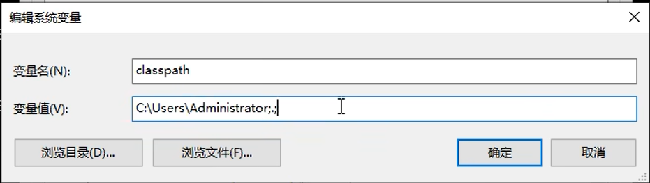

# Java的加载与执行的原理

## 1.Java程序包括两大阶段：

编译阶段：依靠javac.exe命令
运行阶段：依靠java.exe命令
编译和运行可以在不同的OS上进行。

## 2. 描述整个过程：

### 2.1

程序员新建一个.java结尾的文件，该文件称为源文件，在该文件中编写Java源码。语法要保证正确。

### 2.2 使用javac.exe命令对Xxx.java文件进行编译工

语法：
javac java源文件的路径
注意：java源文件的路径可以是绝对路径，也可以是相对路径。

### 2.3 当java源文件语法合法，经过javac进行编译，会生成1-N个class文件。

### 2.4 Xxxx.class文件称为字节码文件，字节码文件不是纯机器码，操作系统无法执行执行。

### 2.5 使用java命令来运行java程序：

语法：
java 类名
什么是类名？
A.class则类名是A
T.class则类名是T

### 2.6 描述 java 这个命令执行之后发生了什么？

首先java命令会启动JVM。
JVM会启动classloader（类加载器）
classloader通过一个环境变量classpath找"T.class"文件

### 2.7 找不到则报错，找到则执行，怎么执行？

执行 T.class 中的入口方法：main 方法。

### 2.8 JVM会将c1ass字节码文件解释成纯机器码二进制，操作系统执行机器码和底层硬件平台进行交互。

# 环境变量

## path

PATH环境变量
1.PATH环境变量和java无关，是OS级别的一个环境变量。
2．windows操作系统找命令的时候从哪里开始找？
默认情况下是从当前路径下找命令，如果找不到，再去path环境变量中查找。如果找到了则执行，找不到就会报错，错误信息如下：
'fdsafds'不是内部或外部命令，也不是可运行的程序或批处理文件

## classpath

1.这个环境变量是隶属于java的，和操作系统无关。

2.这个环境变量是给谁指路的？

是给类加载器指路的。

3.类加载：classloader

classloader会从classpath环境变量指定的路径中搜索“字节码文件”
找到字节码则执行，找不到字节码报错，错误信息如下：

```
    错误：找不到或无法加载主类Test  
  原因：java.lang.ClassNotFoundException:Test
```

4.当classpath没有配置的情况下，classloader默认去哪里找？

默认去“当前路径”下找。

5.当在操作系统中有了这样一个变量的时候 找不到也不会去 当前目录下查找.class文件



<!-- ... existing code ... -->

5.当在操作系统中有了这样一个变量的时候 找不到也不会去 当前目录下查找.class文件


---

# 补充：classpath 进阶、JAR包、ClassLoader 双亲委派机制

> 以下内容是对上面 classpath 和 classloader 的深入补充。

## 补充1：classpath 进阶用法

### 1.1 显式指定 classpath 的两种方式

方式一：命令行 -cp 参数
java -cp ".;C:\libs;C:\myclasses" com.laodu.p8.HelloWorld
方式二：配置系统环境变量 CLASSPATH
CLASSPATH=.;C:\libs;C:\myclasses
- `-cp` 等价于 `-classpath`
- 多个路径用分号 `;` 分隔（Windows），冒号 `:` 分隔（Linux/Mac）
- `.` 代表当前目录

### 1.2 重要结论

一旦显式设置了 classpath（无论通过 -cp 还是环境变量），classloader 不再默认去当前目录找，必须手动把 `.` 加进去。

### 1.3 classpath 支持的形式

- 目录路径（.class文件所在的文件夹）
- JAR文件路径（如 C:\libs\gson.jar）
- 通配符 `*`（加载目录下所有JAR）
  java -cp ".;C:\libs*" com.laodu.p8.HelloWorld
- 总结：classpath = 告诉classloader"除了Java SE核心类之外，我的类都在哪些地方"
- 不指定 → 默认当前目录
- 指定了 → 只在你指定的地方找，当前目录不再默认包含

## 补充2：JAR包

1.JAR（Java Archive）本质是一个zip压缩包，内部按包名目录结构存放.class文件。

2.JAR包对classloader来说就是一个"路径"，classloader会自动进入JAR内部按目录结构查找.class文件。

3.使用第三方类库时，只需要把JAR包的路径加到classpath中即可：
java -cp ".;C:\libs\gson-2.10.1.jar" com.laodu.p8.HelloWorld
4.Maven/Gradle等构建工具本质上就是在自动管理classpath（自动下载依赖JAR并拼接到classpath）。

## 补充3：缺少class文件会怎样？

### 情况一：缺少启动类（main方法所在的类）

程序直接无法启动，报错：
错误: 找不到或无法加载主类 HelloWorld 原因: java.lang.ClassNotFoundException: HelloWorld
### 情况二：缺少程序运行中用到的其他类

程序能启动，但运行到用到那个类的时候才报错（懒加载机制）：
java public class A { public static void main(String[] args) { System.out.println("开始执行"); // 正常输出 B b = new B(); // 这里报错！如果B.class找不到 } }
输出结果：
开始执行 Exception in thread "main" java.lang.NoClassDefFoundError: B at A.main(A.java:3) Caused by: java.lang.ClassNotFoundException: B
- 程序不是启动时就崩，而是"用到哪个类才加载哪个类"
- 加载不到就抛 NoClassDefFoundError（底层原因是 ClassNotFoundException）
- 如果代码中某条分支永远走不到，那个分支里引用的类即使缺失也不会报错

总结：
- 缺启动类 → 启动就崩（ClassNotFoundException）
- 缺其他类 → 用到时才崩（NoClassDefFoundError）

## 补充4：ClassLoader 类加载器 —— 双亲委派机制

> ⚠️ 注意：Java 9（2017年）引入了模块化系统（JPMS），类加载器体系发生了变化。以下同时标注 Java 8 和 Java 9+ 的差异。

### 4.1 java命令执行后的完整流程

1. java.exe 启动 JVM
2. JVM 启动三层类加载器
3. 类加载器按"双亲委派"机制加载类
4. 找到启动类的 .class 文件后，经过 加载→链接→初始化 三个阶段
5. 找到 main 方法入口，开始执行程序
6. JVM 将字节码解释成机器码，与操作系统/硬件交互

### 4.2 三层类加载器

| 加载器 | 职责 | Java 8 及以前 | Java 9+（含JDK 23） |
|--------|------|---------------|---------------------|
| Bootstrap ClassLoader（启动类加载器） | 最先加载 | 加载 rt.jar、resources.jar 等JRE核心JAR | 加载Java平台核心模块（java.base等），不再有rt.jar |
| Extension / Platform ClassLoader | 第二个加载 | 叫 Extension ClassLoader，加载 jre/lib/ext/ 下的JAR | 改名为 Platform ClassLoader，加载Java平台非核心模块 |
| Application ClassLoader（应用类加载器） | 最后加载 | 加载用户classpath下的类（没变） | 加载用户classpath下的类（没变） |

> 关键差异：Java 9+ 移除了 rt.jar 和 jre/lib/ext/ 目录，改为模块化方式。Extension ClassLoader 改名为 Platform ClassLoader。

### 4.3 双亲委派机制的工作流程

当需要加载一个类（比如 com.laodu.p8.HelloWorld）时：

第1步：Application ClassLoader 收到加载请求，先不自己加载，委托给父加载器 Platform ClassLoader

第2步：Platform ClassLoader 收到请求，也不自己加载，继续委托给父加载器 Bootstrap ClassLoader

第3步：Bootstrap ClassLoader 检查自己负责的核心模块中有没有这个类 → 没有 → 退回给 Platform ClassLoader

第4步：Platform ClassLoader 检查自己负责的平台模块中有没有 → 没有 → 退回给 Application ClassLoader

第5步：Application ClassLoader 在 classpath 指定的路径中查找 .class 文件
- 找到 → 加载到JVM → 完成加载
- 找不到 → 抛出 ClassNotFoundException

简而言之：先上后下，父加载器优先加载，找不到才轮到子加载器。

### 4.4 类加载的三个阶段

1. Loading（加载）：找到.class文件的字节流，在方法区创建对应的Class对象
2. Linking（链接）：
   - 验证（Verification）：校验字节码是否合法、安全
   - 准备（Preparation）：为静态变量分配内存并赋默认值（如int→0，引用→null）
   - 解析（Resolution）：将符号引用转为直接引用
3. Initialization（初始化）：执行静态代码块、静态变量赋真实值

### 4.5 为什么要用双亲委派？

- 安全性：用户自定义的类无法冒充核心类（比如你自己写一个 java.lang.String，不会被加载，因为 Bootstrap 已经加载过了）
- 避免重复加载：父加载器已经加载过的类，子加载器不会再加载

### 4.6 懒加载机制

classloader 不是启动时一次性加载所有类，而是"用到哪个类才加载哪个类"。
更准确地说：类的加载（Loading）可能是懒的，但初始化（Initialization）一定是懒的——类第一次被主动使用时才初始化。
这就是为什么缺少非启动类时，程序能启动但运行到那行代码才报错。